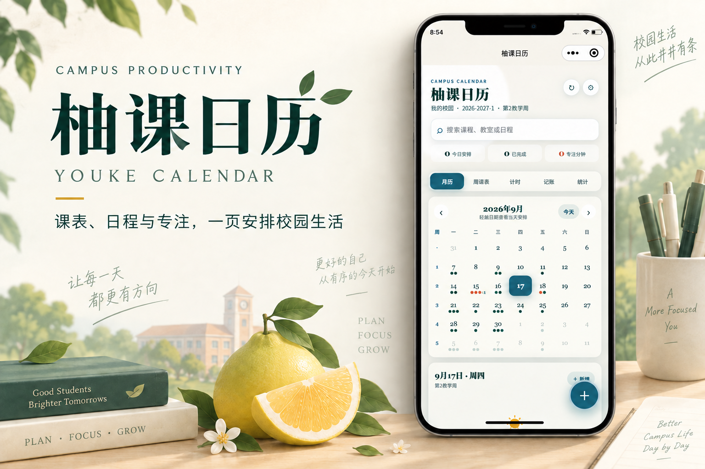

<div align="center">
  <p><strong>English</strong> · <a href="README.zh-CN.md">简体中文</a></p>
  
  <h1>Youke Calendar · 柚课日历</h1>
  <p>Timetables, plans, and focus sessions for everyday campus life.</p>
  <p>
    
    
    
  </p>
</div>



Youke Calendar is a campus productivity toolkit for university students. It combines a native WeChat Mini Program with a responsive, fully offline single-page web app. The project is not tied to one university: school names, academic portals, semester details, and class-period times are configurable. New users start with an empty calendar and can add events or import a timetable when they are ready.

## Features

| Area | What it provides |
| --- | --- |
| Calendar and timetable | Monthly calendar, weekly timetable, teaching-week tracking, personal events, search, completion state, and conflict warnings |
| Bring-your-own-model import | Mini Program only: local PDF, TXT, CSV, DOCX, XLSX, and XLS extraction with the user's chosen model |
| Study timer | Countdown and stopwatch tasks, configurable focus/rest durations, and completed study records |
| Campus budgeting | Income and expense entries, category summaries, and trend visualization |
| Insights | Study-time totals, income/expense breakdowns, and recent trends |
| Personalization | Color themes, built-in wallpapers, local custom wallpapers, and card-opacity controls |
| Two clients | A WeChat Mini Program and a build-free single-page web version |

## Supported timetable formats

The Mini Program sends timetable content directly to the model provider selected by the user. It can capture course names, instructors, rooms, weekdays or exact dates, class periods, teaching weeks, and explicit start/end times. Supported presets include OpenAI, Gemini, Claude, DeepSeek, Kimi, Qwen, GLM, and SiliconFlow, plus a custom OpenAI-compatible endpoint.

- Traditional weekday-by-period timetable grids
- Course lists that include exact start and end times
- Date-based schedules without a recurring weekday
- Representative timetable text copied from a university academic system

PDF, TXT, CSV, DOCX, XLSX, and XLS files are converted to text locally inside the Mini Program before the text is sent to the selected provider. This gives every preset—including DeepSeek, Kimi, Qwen, GLM, SiliconFlow, and custom OpenAI-compatible endpoints—the same file-import flow. Parsing intentionally relies on the selected model and has no rule-based course fallback, so imported times should always be reviewed. Image-only or scanned PDFs need OCR first.

## Repository structure

```text
.
├─ apps/
│  ├─ miniprogram/          # Native WeChat Mini Program (TypeScript)
│  └─ web/                  # Responsive single-page web app
├─ assets/
│  ├─ readme/               # README promotional assets
│  └─ youke-calendar-avatar.png
├─ README.md                # English
└─ README.zh-CN.md          # Simplified Chinese
```

Source directories and filenames use English. The current product interface is written in Chinese.

## Quick start

### WeChat Mini Program

1. Install [WeChat Developer Tools](https://developers.weixin.qq.com/miniprogram/dev/devtools/download.html).
2. Import `apps/miniprogram` and enter your own Mini Program AppID.
3. Install dependencies and run the type check:

```bash
cd apps/miniprogram
npm install
npm run typecheck
```

For AI timetable import, open Calendar Settings and choose a model provider, then enter your own endpoint, model name, and API key. Open the import panel and select a PDF, TXT, CSV, DOCX, XLSX, or XLS file; the Mini Program extracts its text locally and sends that text to the configured model. Pasting timetable text remains available as an alternative.

The local extractors are checked into the Mini Program so WeChat DevTools can open the project directly. After changing extractor dependencies, rebuild them with `pnpm run build:extractors` from `apps/miniprogram`.

Before releasing the Mini Program, add every provider domain you intend to support to **Development → Development Management → Development Settings → Server Domain Names → request legal domains** in the WeChat public platform. Custom endpoints also need to be allowlisted there.

### Web app

The web app is completely offline: no backend, installation, build command, account, or API key is required.

1. Click **Code → Download ZIP** on GitHub and extract the archive.
2. Open the extracted `apps/web` folder.
3. Double-click **`index.html`** to start using Youke Calendar in your browser.

All web data stays in the current browser. Add a course through **Add Event → Course**. File-based timetable import and cloud synchronization are intentionally not included in the web version.

## Data and privacy

- Events, timetable data, study records, transactions, and appearance settings are stored locally by default.
- The app does not request or store university sign-in credentials.
- The user's model API key is stored only in local Mini Program storage. It is never committed to the repository or sent to a project-owned server.
- Source timetable files stay on the device. Extracted timetable text is sent directly from the Mini Program to the provider selected by the user and is subject to that provider's privacy policy.
- The web version makes no backend requests and keeps its application data in the current browser.

## Verification

```bash
# Mini Program type check
cd apps/miniprogram
npm run typecheck

# JavaScript syntax check (from the repository root)
node --check apps/web/app.js
```

The Mini Program type check covers the provider adapters and timetable-to-event conversion. Period mappings include `Periods 1–2 → 08:00–09:40`, `Periods 7–9 → 14:00–16:35`, and `Periods 12–14 → 19:20–21:55`.

## Known limitations

- Users need their own model account and API key; provider usage may incur charges.
- WeChat production builds can only call model domains configured in the Mini Program's request-domain allowlist.
- PDF, TXT, CSV, DOCX, XLSX, and XLS imports work with every configured provider because extraction happens locally before the request.
- The web version supports manual course entry but does not import timetable PDFs.
- File layouts vary widely, scanned PDFs need OCR, and users remain responsible for reviewing imported course data.
- Web data is stored in the current browser and will not survive cleared site data or automatically move to another device.
- Cross-device account synchronization is not currently available in either client.

## License

No open-source license has been added yet. Until a license is provided, all rights are reserved by default.
